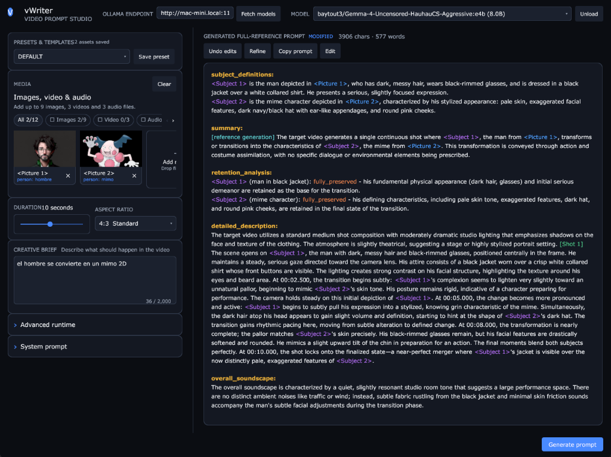

# vWriter

A native desktop app that turns a creative brief plus image, video, and audio
references into a structured full-reference video prompt, powered by a local
or remote [Ollama](https://ollama.com) vision model.



vWriter follows the official MiniMax H3 full-reference prompt-writing guide to
produce a six-section prompt (`subject_definitions`, `summary`,
`retention_analysis`, `detailed_description`, `overall_soundscape`,
`non_diegetic_music`) ready to paste into your video-generation workflow.

## Features

- **Full-reference media support**: up to 9 pictures, 3 videos, and 3 audio files
  (12 assets total), numbered as `<Picture N>`, `<Video N>`, `<Audio N>`.
- **Semantic Asset Types & Roles**: Assign custom types (`person`, `scene`, `clothes`, `accessory`, `reference`, `movement`, `camera`, `music`, `voice`) and labels (e.g. *John*, *office background*) directly to reference assets.
- **Audio-to-Image Voice Linking**: Link audio voice tracks directly to reference person images.
- **Interactive Syntax Highlighting**: Colorized view for generated prompts with instant **`Edit` / `Show`** mode toggle.
- **Live Preset & Template Store**: Real-time auto-saving into templates, with automatic `DEFAULT` preset loading on startup.
- **Ordered Video Contact Sheets**: Auto, 6-frame, and 8-frame video sampling modes.
- **Ollama Integration**: Works with any vision-capable model installed on local or remote Ollama servers.
- **Automatic Context Planning**: Handles context budgets (8K/16K/24K) with manual override capabilities.
- **Output Audit & Repair**: Automatic format compliance check with narrow repair pass.
- **Portable Configuration**: Window size (min 1000x800), panel layouts, and settings live in `config.json` next to the executable.

## Requirements

- [Ollama](https://ollama.com) running locally or on a reachable machine,
  with at least one vision-capable model installed (e.g. `ollama pull gemma3`).
- ffmpeg and ffprobe available in `PATH` (used for video frame sampling and
  audio metadata).
- To build from source: Go 1.24 or newer.

## Run from source

```sh
go run .
```

Build a binary for your platform:

```sh
go build -o vWriter .
```

Convenience scripts build native binaries into `dist/`:

```powershell
.\build_and_run_win.ps1
```

```sh
bash build_linux.sh
bash build_macos.sh
```

## Release Script

To create a new release package for Windows 64-bit, macOS Silicon (ARM64), and Linux 64-bit:

```sh
bash release.sh
```

The release script will:
1. Prompt for a release version tag (e.g. `v1.0.0`) and verify it does not already exist.
2. Prompt for your GitHub token (or read `$GITHUB_TOKEN` from environment).
3. Cross-compile binaries for Windows (x64), macOS (ARM64), and Linux (x64).
4. Create release `.zip` archives containing the compiled executables.
5. Ask for confirmation before creating the git tag, pushing to GitHub, and publishing the release assets.

## App Icon and packaging

`appicon.png` is the production app icon. It is generated from the editable
source at `assets/appicon.svg` and is picked up automatically by Gio's
`gogio` packager for macOS and Linux bundles. On Windows, `vwriter_windows_amd64.syso`
embeds the same icon in every executable.

## License

See [LICENSE](LICENSE).
